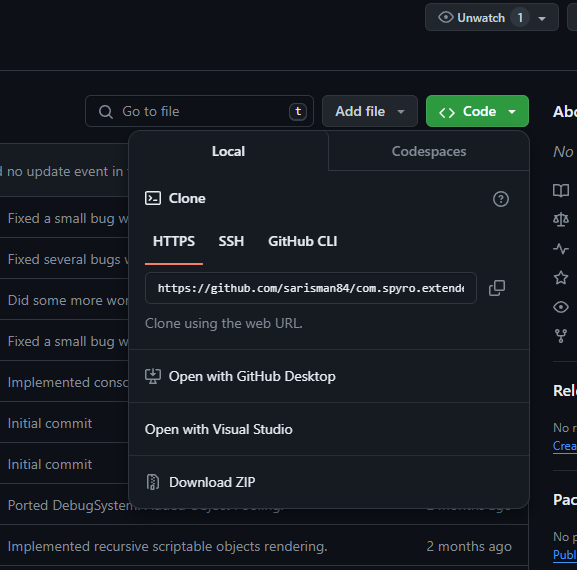
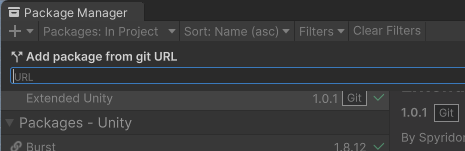

# Extending Unity

This repository contains a collection of packages that contain a variety systems and tools that extend the base functionality of the Unity Engine.

## Features
- Debug Console
- Save System API
- Object Pool API
- State Machine API

## Editor Features
- Custom Tags [W.I.P]
- Recursive ScriptableObject Editors

Further features and improvements are in the works such as:
- Platform Character Controller
- Rail System

Lastly, some example scenes are also going to be implemented to help with onboarding.

This is a personal project that i use in most of my projects so updates will come and go.

## How to Use
*This package is meant for Unity 2022, you can try older or earlier versions of Unity but i wont confirm that they work.*

1. Copy the clone url from github.

    

2. Paste said url into unity's package manager.

    

The package should automatically download itself after some time.